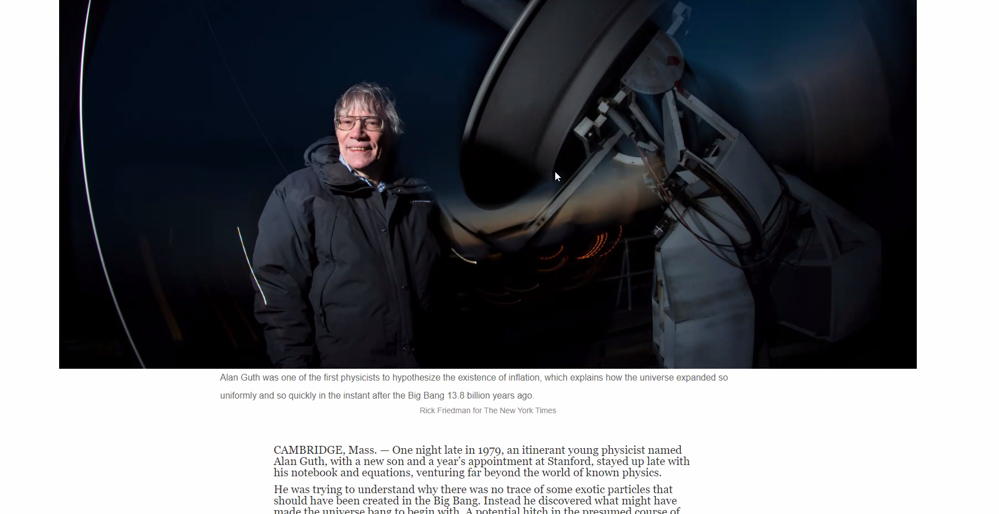

# Project 2: Building with Responsive Design
> Second project of Microverse working with Responsive Design

The project should contain a Header, a Footer, a Highlights section and a Latest funding sections.
## Built With
- HTML
- CSS
## Live Demo
[Live Demo Link](https://fernandorpm.github.io/mv-project2/)
## Install
- open your command prompt
- go to the desired directory
- copy and paste the following code:
- git clone https://github.com/fernandorpm/mv-project2.git
### Usage
Drag the file to a new browser window and enjoy :)
## Authors
:silueta_de_busto: **Tiago Rahal Aires**
- GitHub: [@tiagorahal](https://github.com/tiagorahal)
- Twitter: [@RahalAires](https://twitter.com/RahalAires)
- LinkedIn: [Tiago Rahal Aires](https://linkedin.com/tiagorahal)
:silueta_de_busto: **Fernando R P Marques**
- GitHub: [@fernandorpm](https://github.com/githubhandle)
- Twitter: [@rpm_fernando](https://twitter.com/rpm_fernando)
- LinkedIn: [Fernando R P Marques](https://linkedin.com/fernandorpm)
## :apretón-manos: Contributing
Contributions, issues, and feature requests are welcome!
Feel free to check the [issues page](issues/).
## Show your support
Give a :estrella:️ if you like this project!
## Acknowledgments
- Hat tip to anyone whose code was used
- Inspiration
- etc
## :nota: License
This project is [MIT](lic.url) licensed. 
